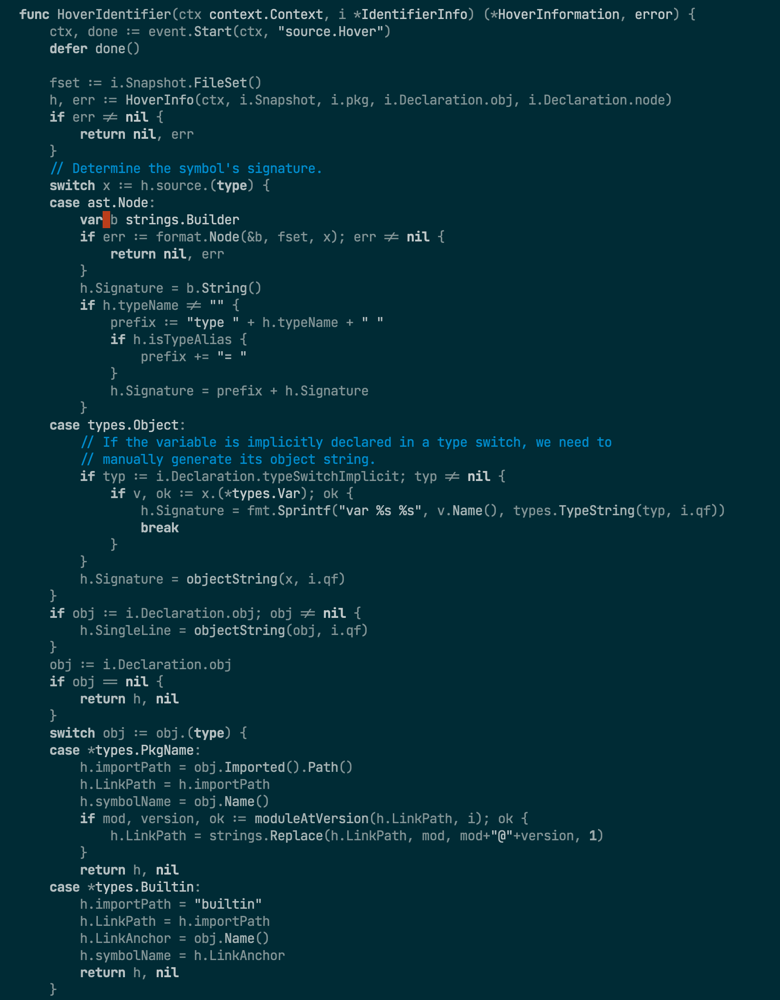

# Monarized-theme

A Monochrome variation of Solarized for Doom Emacs.

## Configuration

```
(defcustom doom-monarized-brighter-modeline nil
  "If non-nil, more vivid colors will be used to style the mode-line."
  :group 'doom-monarized-theme
  :type 'boolean)
```

## Screenshot


